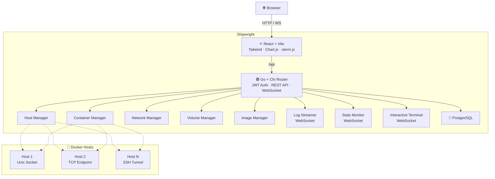

# Shipwright

A centralized multi-host Docker management dashboard built with **Go** and **React/TypeScript**. Monitor and manage containers, images, networks, and volumes across multiple Docker hosts from a single web interface.


---

## Features

- **Multi-host management** — Register Unix socket, TCP, or SSH Docker hosts
- **Container lifecycle** — Create, start, stop, and remove containers with port mappings
- **Real-time logs** — Stream container logs via WebSocket with tail control
- **Live stats** — CPU, memory, network, and block I/O charts updated in real-time
- **Interactive terminal** — Browser-based shell via xterm.js and Docker exec
- **Network management** — Create, delete, connect/disconnect containers from networks
- **Volume management** — Create and remove volumes
- **Image management** — Pull and delete images; dangling images filtered by default
- **Production-ready** — Multi-stage Docker builds, Nginx reverse proxy, health checks

---

## Architecture



---

## Quick Start

### Docker Compose (Recommended)

Shipwright ships as a Docker Compose stack. Pick your path:

#### Development

Hot-reload enabled for both frontend and backend:

```bash
git clone https://github.com/YOUR_USERNAME/shipwright.git
cd shipwright
cp .env.example .env    # edit with your own values
make dev-up
```

| Service | URL |
|---|---|
| Frontend | http://localhost:5173 |
| Backend API | http://localhost:8080 |
| PostgreSQL | localhost:5432 |

#### Production

```bash
cp .env.example .env
# Edit .env — set strong POSTGRES_PASSWORD and JWT_SECRET
docker compose -f docker-compose.prod.yaml up -d
```

Then open **http://localhost**.

---

### Also runs on Kubernetes

An optional [kind](https://kind.sigs.k8s.io/) deployment example is available at [`deploy/kind-example/`](deploy/kind-example/).

```bash
cp deploy/kind-example/secret.yaml.example deploy/kind-example/secret.yaml
bash scripts/k8s-deploy.sh
```

See [`deploy/kind-example/README.md`](deploy/kind-example/README.md) for full details and limitations.

---

## Project Structure

```
shipwright/
├── backend/
│   ├── cmd/server/          # Entrypoint (--migrate flag for DB migrations)
│   ├── internal/            # Handlers, middleware, auth, repository, config
│   ├── pkg/dockerclient/    # Docker SDK client + DockerProvider interface
│   ├── migrations/          # PostgreSQL schema migrations
│   └── Dockerfile           # Multi-stage production build (~11MB)
├── frontend/
│   ├── src/                 # React components, pages, services
│   ├── Dockerfile           # Multi-stage build with Nginx (~21MB)
│   └── nginx.conf           # SPA routing, gzip, API proxy
├── deploy/kind-example/     # Kubernetes manifests (optional learning path)
│   ├── kind-cluster.yaml
│   ├── namespace.yaml
│   ├── postgres-*.yaml
│   ├── backend-*.yaml
│   ├── frontend-*.yaml
│   ├── secret.yaml.example  # Template (real secret.yaml is gitignored)
│   └── ingress.yaml
├── docker-compose.yaml      # Dev stack with hot-reload
├── docker-compose.prod.yaml # Production stack
├── Makefile
└── scripts/k8s-deploy.sh
```

---

## Testing

```bash
make test           # Backend tests
make test-cover     # Tests with coverage report
make lint           # Lint backend + frontend
make lint-backend   # Backend lint only
make lint-frontend  # Frontend lint only (or lint-frontend-fix)
```

---

## License

MIT
