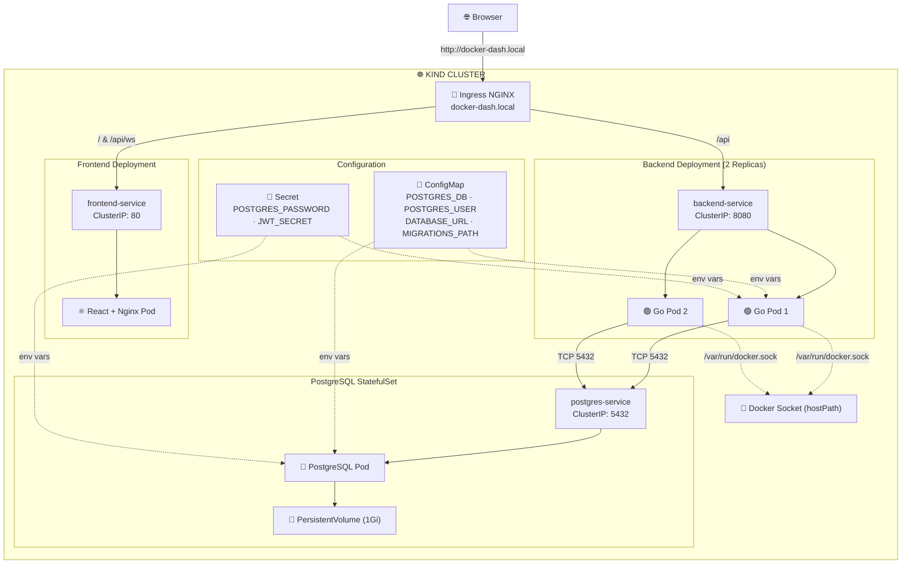

# Shipwright

A centralized multi-host Docker management dashboard built with **Go** and **React/TypeScript**. Monitor and manage containers, images, networks, and volumes across multiple Docker hosts from a single web interface.


---

## Project architechture

```mermaid
flowchart TD
    Browser["🌐 Browser"] -->|HTTP / WS| Ingress

    subgraph K8S["☸️ Kubernetes Cluster"]
        Ingress["🚦 Ingress NGINX<br/>docker-dash.local"]

        subgraph Frontend["⚛️ Frontend (React + Vite)"]
            ReactUI["React + Tailwind<br/>Charts, xterm.js"]
            FrontendSVC["frontend-service<br/>ClusterIP :80"]
            ReactUI --> FrontendSVC
        end

        subgraph Backend["🟢 Backend (Go + Chi)"]
            APIRouter["API Router + JWT Auth"]
            HostMgr["Host Manager"]
            ContainerMgr["Container Manager"]
            NetworkMgr["Network Manager"]
            VolumeMgr["Volume Manager"]
            ImageMgr["Image Manager"]
            LogStream["Log Streamer<br/>WebSocket"]
            StatsMon["Stats Monitor<br/>WebSocket"]
            Terminal["Interactive Terminal<br/>WebSocket"]
            BackendSVC["backend-service<br/>ClusterIP :8080"]

            APIRouter --> HostMgr
            APIRouter --> ContainerMgr
            APIRouter --> NetworkMgr
            APIRouter --> VolumeMgr
            APIRouter --> ImageMgr
            APIRouter --> LogStream
            APIRouter --> StatsMon
            APIRouter --> Terminal
            APIRouter --> BackendSVC
        end

        subgraph Database["🐘 PostgreSQL StatefulSet"]
            PostgresSVC["postgres-service<br/>ClusterIP :5432"]
            PostgresPod["PostgreSQL Pod"]
            PV["💾 PV 1Gi"]

            PostgresSVC --> PostgresPod --> PV
        end

        subgraph Config["⚙️ Configuration"]
            CM["📄 ConfigMap<br/>DATABASE_URL<br/>MIGRATIONS_PATH<br/>POSTGRES_DB / USER"]
            Sec["🔐 Secret<br/>POSTGRES_PASSWORD<br/>JWT_SECRET"]
        end

        Ingress -->|"/ /ws"| FrontendSVC
        Ingress -->|"/api"| BackendSVC

        HostMgr -.->|Docker Socket| D1
        HostMgr -.->|Docker Socket| D2
        HostMgr -.->|Docker Socket| DN
        ContainerMgr -.->|Docker SDK| D1
        NetworkMgr -.->|Docker SDK| D1
        VolumeMgr -.->|Docker SDK| D1
        ImageMgr -.->|Docker SDK| D1

        BackendSVC -->|TCP 5432| PostgresSVC
        CM -.->|env| BackendSVC
        Sec -.->|env| BackendSVC
        CM -.->|env| PostgresPod
        Sec -.->|env| PostgresPod
    end

    subgraph Hosts["🐳 Docker Hosts"]
        D1["Docker Host 1<br/>Docker Daemon"]
        D2["Docker Host 2<br/>Docker Daemon"]
        DN["Docker Host N<br/>Docker Daemon"]
    end

    D1 -.->|"hostPath<br/>/var/run/docker.sock"| Backend
    D2 -.->|"registered<br/>TCP endpoint"| Backend
    DN -.->|"registered<br/>TCP endpoint"| Backend
```



---

## Features

- **Multi-host management** — Register Unix socket, TCP, or SSH Docker hosts
- **Container lifecycle** — Create, start, stop, and remove containers with port mappings
- **Real-time logs** — Stream container logs via WebSocket with tail control
- **Live stats** — CPU, memory, network, and block I/O charts updated in real-time
- **Interactive terminal** — Browser-based shell via xterm.js and Docker exec
- **Network management** — Create, delete, connect/disconnect containers from networks
- **Volume management** — Create and remove volumes
- **Image management** — Pull and delete images; dangling images filtered by default
- **Production-ready** — Multi-stage Docker builds, Nginx reverse proxy, health checks

---


## Architecture(k8s)



---

## Quick Start

### Docker Compose (Development)

```bash
git clone https://github.com/YOUR_USERNAME/shipwright.git
cd shipwright
make dev-up
```

| Service | URL |
|---|---|
| Frontend | http://localhost:5173 |
| Backend API | http://localhost:8080 |
| PostgreSQL | localhost:5432 |

### Kubernetes (kind)

```bash
cd shipwright
bash scripts/k8s-deploy.sh
```

Add to `/etc/hosts`:
```
127.0.0.1 docker-dash.local
```

Then open **http://docker-dash.local**

---

## Project Structure

```
shipwright/
├── backend/
│   ├── cmd/server/          # Entrypoint (--migrate flag for DB migrations)
│   ├── internal/            # Handlers, middleware, auth, repository, config
│   ├── pkg/dockerclient/    # Docker SDK client + DockerProvider interface
│   ├── migrations/          # PostgreSQL schema migrations
│   └── Dockerfile           # Multi-stage production build (~11MB)
├── frontend/
│   ├── src/                 # React components, pages, services
│   ├── Dockerfile           # Multi-stage build with Nginx (~21MB)
│   └── nginx.conf           # SPA routing, gzip, API proxy
├── infra/k8s/              # Kubernetes manifests
│   ├── kind-cluster.yaml
│   ├── namespace.yaml
│   ├── postgres-*.yaml
│   ├── backend-*.yaml
│   ├── frontend-*.yaml
│   └── ingress.yaml
├── docker-compose.yaml      # Dev stack
├── docker-compose.prod.yaml # Production stack
├── Makefile
└── scripts/k8s-deploy.sh
```

---

## Testing

```bash
make test           # Backend tests
make test-cover     # Tests with coverage report
make lint           # Lint backend + frontend
make lint-backend   # Backend lint only
make lint-frontend  # Frontend lint only (or lint-frontend-fix)
```

---

## License

This project is private and proprietary.